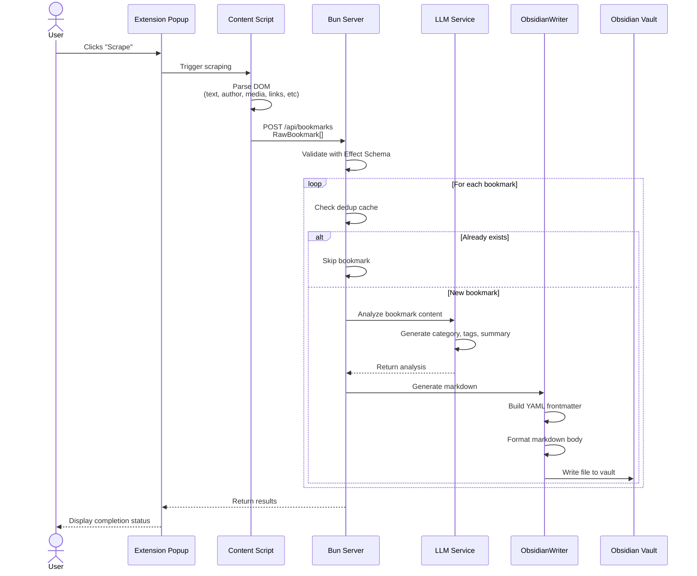

# X Bookmarks to Obsidian

Export your X/Twitter bookmarks to your Obsidian vault with AI-powered categorization and tagging.

```mermaid
graph LR
    A["X / Twitter<br/>Bookmarks"] -->|DOM scraping| B["Chrome Extension"]
    B -->|POST /api/bookmarks<br/>RawBookmark Array| C["Bun Server<br/>Effect-TS"]
    C -->|results| B
    
    C --> D["LLM Service<br/>Claude/Gemini"]
    D --> E["BookmarkAnalyzer<br/>category, tags, summary"]
    E --> F["ObsidianWriter<br/>markdown, dedup"]
    F -->|fs.write| G["Obsidian Vault<br/>Bookmarks/"]
    
    style A fill:#1DA1F2,color:#fff
    style B fill:#4A90E2,color:#fff
    style C fill:#2C3E50,color:#fff
    style D fill:#27AE60,color:#fff
    style E fill:#27AE60,color:#fff
    style F fill:#27AE60,color:#fff
    style G fill:#8E44AD,color:#fff
```



## What It Does

1. **Scrapes** your X/Twitter bookmarks page via a Chrome extension
2. **Analyzes** each bookmark using an LLM (Claude or Gemini) to determine:
   - Category: `thread`, `link`, `image`, `quote`, or `standalone`
   - Tags for Obsidian (e.g., "TypeScript", "Machine Learning")
   - Optional summary
3. **Writes** formatted Markdown notes to your Obsidian vault with:
   - YAML frontmatter (author, date, tags, topics as wikilinks)
   - Tweet content with proper formatting
   - Embedded media, links, and quoted tweets
   - Automatic deduplication

## Tech Stack

| Component | Technology |
|-----------|------------|
| Runtime | Bun |
| Backend | Effect-TS (services, error handling, schema validation) |
| LLM | @effect/ai with Anthropic (Claude) or Google (Gemini) |
| Extension | Chrome Manifest V3, TypeScript |
| Monorepo | Bun workspaces |

## Project Structure

```
x-to-obsidian/
├── packages/
│   ├── core/                 # Shared types & Effect schemas
│   │   └── src/
│   │       └── schema.ts     # RawBookmark, AnalyzedBookmark, ObsidianNote
│   │
│   ├── server/               # Bun + Effect backend
│   │   └── src/
│   │       ├── index.ts      # HTTP server (Bun.serve)
│   │       ├── config.ts     # Environment configuration
│   │       ├── routes/
│   │       │   └── bookmarks.ts    # POST /api/bookmarks handler
│   │       └── services/
│   │           ├── LLM.ts              # Claude/Gemini abstraction
│   │           ├── BookmarkAnalyzer.ts # Prompt building & response parsing
│   │           └── ObsidianWriter.ts   # Markdown generation & file writing
│   │
│   └── extension/            # Chrome extension
│       ├── manifest.json
│       └── src/
│           ├── background.ts   # Service worker
│           ├── content.ts      # DOM scraper (injected into x.com)
│           └── popup/          # Extension popup UI
```

## Data Flow



## Output Example

Each bookmark becomes a Markdown note like:

```markdown
---
category:
  - "[[Bookmarks]]"
tags:
  - bookmarks
  - twitter
author:
  - "[[Dan Abramov]]"
url: https://x.com/dan_abramov/status/1234567890
created: 2024-01-15
published: 2024-01-15
topics:
  - "[[React]]"
  - "[[JavaScript]]"
  - "[[Web Development]]"
tweet_id: "1234567890"
bookmark_type: standalone
---

# Tweet by @dan_abramov

> Here's a cool trick for React components...

## Summary

Explains a pattern for optimizing React re-renders using memo.

## Links

- [example.com/article](https://example.com/article)

## Media


```

## Setup

### Prerequisites

- [Bun](https://bun.sh) installed, **or** [Nix](https://nixos.org) with `flake.nix` support
- An Obsidian vault
- API key for Claude (Anthropic) or Gemini (Google)

### Installation

#### With Bun

```bash
# Clone and install
git clone <repo>
cd x-to-obsidian
bun install

# Configure environment
cp .env.example .env
# Edit .env with your settings
```

#### With Nix

```bash
# Clone the repo
git clone <repo>
cd x-to-obsidian

# Enter Nix environment (installs Bun automatically)
nix flake update
direnv allow    # or: nix develop

# Configure environment
cp .env.example .env
# Edit .env with your settings
```

### Environment Variables

```bash
# Required
VAULT_PATH=/path/to/your/obsidian/vault

# LLM Provider (choose one)
LLM_PROVIDER=google          # or "anthropic"
GOOGLE_API_KEY=your-key      # if using Gemini
ANTHROPIC_API_KEY=your-key   # if using Claude

# Optional
BOOKMARKS_FOLDER=Bookmarks   # folder within vault
PORT=3000                    # server port
CLAUDE_TIMEOUT=30000         # LLM timeout in ms
```

### Running

```bash
# Start the server
bun run dev

# Build the extension
bun run --filter @x-to-obsidian/extension build
```

### Loading the Extension

1. Go to `chrome://extensions`
2. Enable "Developer mode"
3. Click "Load unpacked"
4. Select `packages/extension/dist`

## Usage

1. Start the server (`bun run dev`)
2. Navigate to [x.com/i/bookmarks](https://x.com/i/bookmarks)
3. Click the extension icon
4. Click "Scrape Visible" or "Scrape All"
5. Bookmarks appear in your Obsidian vault!

### Options

- **Scrape Visible**: Only scrapes tweets currently on screen
- **Scrape All**: Scrolls through entire bookmarks page
- **Unbookmark after scraping**: Removes bookmarks from X after processing

## License

MIT
